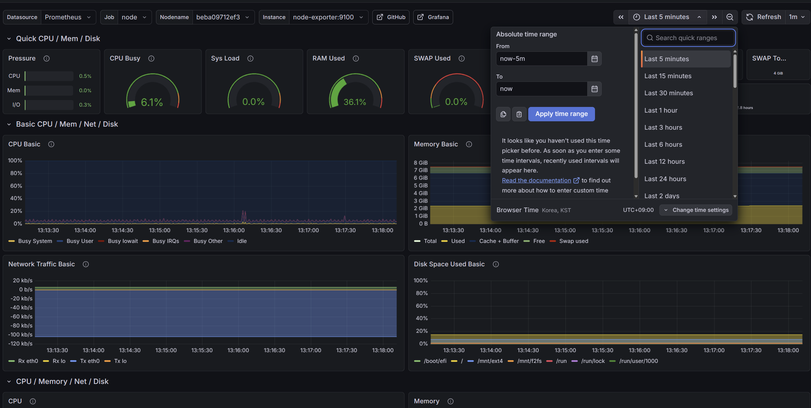

# EXT4(CNS), F2FS(CNS)에 대한 Kafka Broker의 I/O 성능 비교 분석

## 이동혁(2021086917), 최현준(2021037401)
---

# 🧭 전체 목표

- Kafka를 **ext4 / f2fs 각각에서 실행**
- Prometheus + Grafana로 **모니터링**
- `kafka-benchmarking`으로 **성능 비교 실험**

---

# 0. 환경 전제

- Ubuntu (22.04+ 권장)
- SSD (NVMe)
- Docker / Docker Compose 사용
- 실험은 producer → consumer 순으로 진행.
    - 내부적으로는 f2fs → ext4, 각 파일 시스템당 3번의 small load (1M) → big load (10M)으로 진행.

---

# 1. 디스크 파티셔닝

## 목표 구조

| 파티션 | 용도 |
| --- | --- |
| / | Ubuntu (100GB) |
| /mnt/ext4 | Kafka ext4 |
| /mnt/f2fs | Kafka f2fs |

---

## 파티션 생성 (이미 했다면 skip)

```
sudo parted /dev/nvme0n1
print free
```

예:

```
mkpart primary ext4 100GB 150GB
mkpart primary 150GB 200GB
quit
```

---

## 파일시스템 생성

```
sudo mkfs.ext4 /dev/nvme0n1p3
sudo mkfs.f2fs /dev/nvme0n1p4
```

---

## 마운트

```
sudo mkdir -p /mnt/ext4 /mnt/f2fs
```

UUID 확인:

```
blkid
```

`/etc/fstab` 추가:

```
UUID=ext4_uuid /mnt/ext4 ext4 defaults,noatime 0 2
UUID=f2fs_uuid /mnt/f2fs f2fs defaults,noatime 0 2
```

적용:

```
sudo mount -a
```

---

# 2. Docker 설치

```
# Add Docker's official GPG key:
sudo apt update
sudo apt install ca-certificates curl
sudo install -m 0755 -d /etc/apt/keyrings
sudo curl -fsSL https://download.docker.com/linux/ubuntu/gpg -o /etc/apt/keyrings/docker.asc
sudo chmod a+r /etc/apt/keyrings/docker.asc

# Add the repository to Apt sources:
sudo tee /etc/apt/sources.list.d/docker.sources <<EOF
Types: deb
URIs: https://download.docker.com/linux/ubuntu
Suites: $(. /etc/os-release && echo "${UBUNTU_CODENAME:-$VERSION_CODENAME}")
Components: stable
Signed-By: /etc/apt/keyrings/docker.asc
EOF

sudo apt update

sudo apt install docker-ce docker-ce-cli containerd.io docker-buildx-plugin docker-compose-plugin -y

sudo systemctl status docker

sudo groupadd docker
udo usermod -aG docker $USER
newgrp docker
docker run hello-world
```

재로그인

---

# 3. 실험 디렉토리 준비

```
mkdir-p ~/kafka-fs-lab/{jmx,prometheus,grafana/provisioning/datasources}
mkdir-p /mnt/ext4/kafka-data
mkdir -p /mnt/f2fs/kafka-data
```

---

# 4. JMX Exporter 설치

```
cd ~/kafka-fs-lab/jmx

wget -O jmx_prometheus_javaagent.jar \
https://github.com/prometheus/jmx_exporter/releases/download/1.5.0/jmx_prometheus_javaagent-1.5.0.jar
```

확인:

```
file jmx_prometheus_javaagent.jar
```

---

설정 파일 옮기기.

```c

unzip kafka-fs-lab.zip -d ~/kafka-fs-lab
```

---

# 5. 실행

```
cd ~/kafka-fs-lab
docker compose up -d
```

확인:

```
docker ps
```

---

# 7. Grafana 접속 (SSH 터널)

```
ssh -L 3000:localhost:3000 <user@server>
```

브라우저:

```
http://localhost:3000
```

기본 id/pw: admin/admin

```c
dashboard/import/1860 -> prometheus 사용 + 웬만한거 다 있음.
```

---

# 9. Benchmark 도구 설치

```
git clone https://github.com/gkoenig/kafka-benchmarking.git
cd kafka-benchmarking
chmod +x producer/scripts/*.sh
```

---

# 10. output 디렉토리 생성

```
mkdir -p /tmp/output
```

---

# 11. ext4 테스트

```sql
docker cp ~/kafka-benchmarking/producer/scripts/benchmark-producer.sh kafka-ext4:/tmp/

docker exec -it kafka-ext4 /bin/bash

mkdir -p /tmp/output
chmod 777 /tmp/output

export KAFKA_TOPICS_CMD="/opt/kafka/bin/kafka-topics.sh"
export KAFKA_BENCHMARK_CMD="/opt/kafka/bin/kafka-producer-perf-test.sh"
  
# producer test
KAFKA_JVM_PERFORMANCE_OPTS="" /opt/kafka/bin/kafka-producer-perf-test.sh \
  --topic test-ext4-heavy \
  --num-records 10000000 \
  --record-size 1024 \
  --throughput -1 \
  --producer-props acks=1 compression.type=none batch.size=16384 linger.ms=5 bootstrap.servers=localhost:9092
  
# consumer test
KAFKA_JVM_PERFORMANCE_OPTS="" /opt/kafka/bin/kafka-consumer-perf-test.sh \
  --topic test-ext4-heavy \
  --messages 1000000 \
  --bootstrap-server localhost:9092 \
  --fetch-size 1048576 \
  --threads 1
  
docker cp kafka-ext4:/tmp/output ./ext4-result-big
  
```

---

# 12. f2fs 테스트

```sql
docker cp ~/kafka-benchmarking/producer/scripts/benchmark-producer.sh kafka-f2fs:/tmp/

docker exec -it kafka-f2fs /bin/bash

mkdir -p /tmp/output
chmod 777 /tmp/output

export KAFKA_TOPICS_CMD="/opt/kafka/bin/kafka-topics.sh"
export KAFKA_BENCHMARK_CMD="/opt/kafka/bin/kafka-producer-perf-test.sh"

# producer test
KAFKA_JVM_PERFORMANCE_OPTS="" /opt/kafka/bin/kafka-producer-perf-test.sh \
  --topic test-f2fs-heavy \
  --num-records 10000000 \
  --record-size 1024 \
  --throughput -1 \
  --producer-props acks=1 compression.type=none batch.size=16384 linger.ms=5 bootstrap.servers=localhost:9094
  
# consumer test
KAFKA_JVM_PERFORMANCE_OPTS="" /opt/kafka/bin/kafka-consumer-perf-test.sh \
  --topic test-f2fs-heavy \
  --messages 1000000 \
  --bootstrap-server localhost:9094 \
  --fetch-size 1048576 \
  --threads 1
docker cp kafka-f2fs:/tmp/output ./f2fs-result
```

---

# 13. 결과 확인

```
scp -r h@192.168.0.23:/home/<사용자명>/kafka-fs-lab/<경로> .
```

👉 CSV / TXT 생성됨

---

# 14. 비교 포인트

Grafana에서 확인:

- throughput
- latency
- disk write
- iowait
- JVM GC

---

# 🧠 실험 팁 (중요)

- 항상 동일 조건으로 반복
- f2fs → ext4 순서로 진행.
- 3회를 진행.

## 비고:

1. 실험 완료 하시고
2. IOPS, throughput (grafana) 
    1. Time frame 설정:
        
        
        
    2. Disk IOps - Inspect
    
    
    
    c. 적절한 data frame (producer: write/ consumer: read) - Download CSV
    
    
    
3. 결과 output 파일 (벤치마크 스크립트)
    
    ```sql
    scp -r h@192.168.0.23:/home/h/kafka-fs-lab/ext4-result1 .
    ```